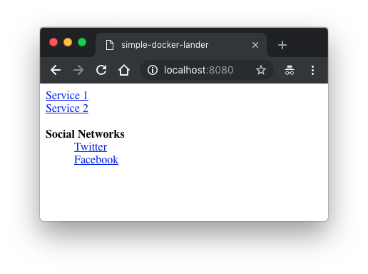

# simple-docker-lander

## What does this do?

It builds a very basic HTML landing page that contains links (passed in via an environment variable) and serves them.

Designed to fit elegantly into a `docker-compose.yml` file.

## How Simple?

Very simple - one file and less than 100 lines of Python.

## What does it look like?

It's plain and simple.



## Usage

Example `docker-compose.yml` file:

```
version: '3.1'
services:
  simple-docker-lander:
    image: benletchford/simple-docker-lander:latest
    restart: always
    ports:
      - 80:80  # or 443:80 if you want to use SSL
    environment:
      SSL_CERTFILE: /etc/letsencrypt/live/example.com/fullchain.pem  # optional
      SSL_KEYFILE: /etc/letsencrypt/live/example.com/privkey.pem  # optional
      CONFIG: |
        site-name: my-awesome-site
        link-mode: tab
        links:
          - name: Service 1
            href: https://www.google.com/
          - name: Service 2
            href: https://reddit.com/
          - name: Twitter
            href: https://twitter.com/
            group: Social Networks
          - name: Facebook
            href: https://facebook.com/
            group: Social Networks
```

As you can see, just populate the `CONFIG` environment variable with a `YAML` string.

## Configuration

`site-name`: the `<title>` value of the HTML document.

`link-mode`: can be set to `tab` or omitted completely for default link behaviour. If `tab`, it adds `target="_blank"` to links.

`links`: a `YAML` array of items each containing both a `name` (link value) and `href` (link target).

`links[].group`: will group together links that have the same group name together under a sub-list.

## Docker Build

Build and run the docker image.

```
$ docker build -t simple-docker-lander .
$ docker run -it --rm -p 80:80 --name simple-docker-lander simple-docker-lander
```

Push the docker image to Docker Hub.

```
$ docker buildx build --push --platform linux/arm/v7,linux/arm64/v8,linux/amd64 --tag benletchford/simple-docker-lander:latest .
```
